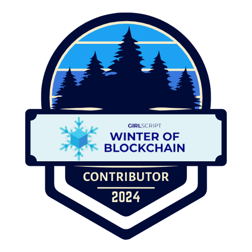

# Sumita here!! 

So hey, I am an aspiring Back-end dev  & a Blockchain enthusiast! 
   
Currently,
 
- 🔭 &nbsp; I’m looking for opportunities in  **backend**
- 📝 &nbsp; Checkout my [resume](https://drive.google.com/file/d/1_ENN0tp3Jy6SvtjFLv7ln2X9jRM2vIfD/view?usp=sharing)
 
Read a bit more to get to know me 

### My tech stack goes like ->

 

### Currently I am Learning
 
 
from [Boot.dev](https://www.boot.dev/tracks/backend)

# Badges 

 
<!-- 
  -->
 

# Ask me anything about -> 
- Backend
- DSA
- Psychology
- Mental Health
- Gym
  
### 🔗 &nbsp; Connect with me

